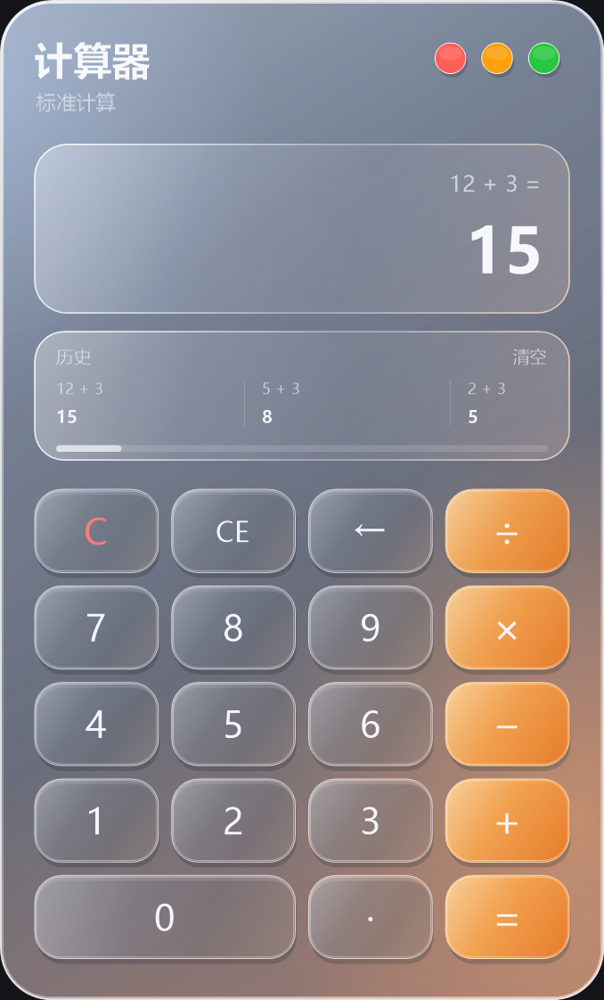

# Apple Glass Calculator

一款为 Windows 10/11 打造的 Apple / macOS 毛玻璃风桌面计算器。



## 项目简介

Apple Glass Calculator 已重写为原生 C++ / Win32 应用。正式下载版是约 380 KB 的单文件 `Calculator.exe`，不依赖 .NET、VC++ Redistributable 或其他第三方运行环境，复制到新的 Windows 10/11 电脑即可直接使用。

仓库同时保留最初的 C# + WPF 实现，方便学习和比较。WPF 版采用 Apple / macOS 风格的半透明毛玻璃 UI，支持基础计算、历史记录、键盘输入和 Windows 高 DPI，也可以发布为独立 EXE。

## UI 风格

- Apple / macOS 风格的透明圆角窗口
- 冷蓝左上高光与暖橙右下光晕组成的玻璃渐变
- 半透明面板、折射描边、柔和阴影与干净的透明四角
- 红、橙、绿窗口按钮依次用于关闭、最小化和拖动
- 原生每像素透明渲染，支持 Windows 高 DPI
- 带透明圆角的专属计算器图标

## 功能介绍

- 加、减、乘、除与小数计算
- 连续运算和重复等号运算
- 退格、清除当前输入和全部清除
- 本地保存最多 50 条历史记录
- 可拖动的横向历史记录滑杆
- 主键盘与数字键盘快捷键
- 关闭、最小化和流畅拖动窗口
- 历史记录保存到 `%LocalAppData%\AppleGlassCalculator\history.json`

## Windows 系统要求

- Windows 10 或 Windows 11，64 位
- 正式原生版无需安装 .NET、VC++ 运行库或其他插件

## 使用方法

1. 从 GitHub Releases 下载 `Calculator.exe`。
2. 将文件复制到任意 Windows 10/11 电脑。
3. 双击即可运行，无需安装。

| 功能 | 按键 |
| --- | --- |
| 数字与小数点 | `0-9`、`.` |
| 运算 | `+`、`-`、`*`、`/` |
| 计算结果 | `Enter` |
| 退格 | `Backspace` |
| 清除当前输入 | `Delete` |
| 全部清除 | `Esc` |

## 开发技术栈

正式原生版：

- C++20
- Win32 API
- GDI+ 每像素透明绘制
- LLVM-MinGW / UCRT 静态链接与 LTO 体积优化

保留的经典版：

- C# 12、.NET 8、WPF / XAML
- `System.Text.Json` 本地历史记录持久化

## 本地编译

### 原生小体积版（推荐）

安装 LLVM-MinGW，然后执行：

```powershell
.\native\build.ps1 -ToolchainRoot "C:\path\to\llvm-mingw"
```

输出文件：

```text
artifacts/native-win-x64/Calculator.exe
```

构建脚本会启用尺寸优化、链接时优化、无用代码移除和符号剥离。

### WPF 经典版

安装 .NET 8 SDK 后执行：

```powershell
dotnet restore
dotnet build
dotnet build -c Release
```

## Release 发布

正式 Release 应上传 `artifacts/native-win-x64/Calculator.exe`。该文件为 `win-x64` 原生单文件应用，不需要随附 DLL，也不要将整个 `artifacts/` 目录提交到源码仓库。

## 项目目录结构

```text
AppleGlassCalculator/
├─ assets/
│  └─ screenshot.png
├─ native/                     # 小体积免依赖原生版
│  ├─ Calculator.ico
│  ├─ app.manifest
│  ├─ app.rc
│  ├─ build.ps1
│  └─ main.cpp
├─ src/AppleGlassCalculator/   # 保留的 C# + WPF 经典版
├─ .gitignore
├─ AppleGlassCalculator.sln
├─ LICENSE
└─ README.md
```

## License

本项目采用 [MIT License](LICENSE)。
